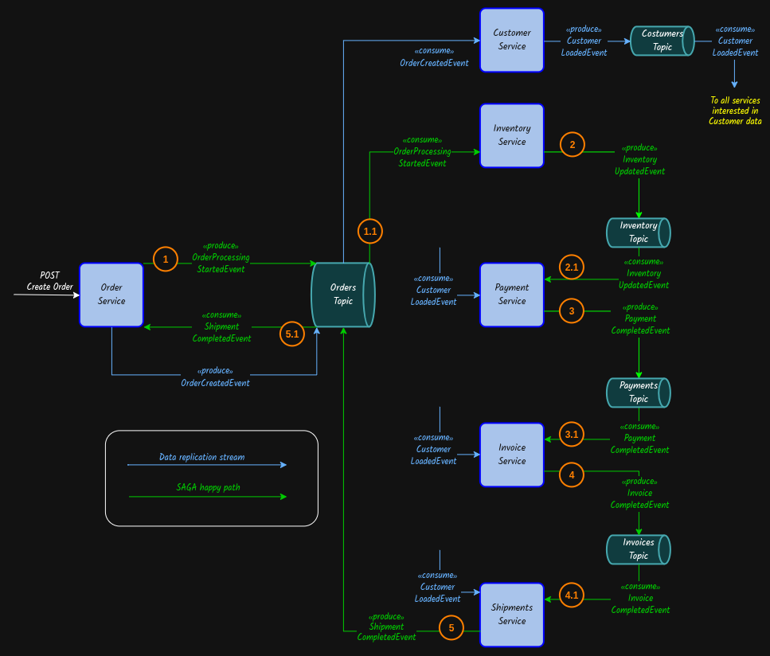

# microservice-ecommerce-orders

## Introduction
This is a Spring Boot microservice project for the **eCommerce Orders Backend Service**.\
The service offers RESTful endpoints for incoming CRUD operations from the outside.\
It "talks" internally with other eCommerce services via event-driven async communication 
using a Kafka broker.

Since this is an educational / portfolio project, it doesn't implement any kind of authentication.\
The project is meant to run exclusively on a local environment.

## Project goals
1. Show in practice **event-driven communication** between microservices.
2. Show in practice the **Single-Database-per-Service** pattern with data replication among multiple microservices.
3. Show in practice the **Choreography based SAGA** pattern in action with multiple microservices.
4. ~~Show in practice the Idempotence aspect of operations on event-driven microservices.~~ (TO BE DONE)
5. ~~Show in practice the Retry mechanism + Dead-Letter-Queue for failing operations on event-driven microservices.~~ (TO BE DONE)
6. ~~Show in practice the Circuit Breaker pattern.~~ (TO BE DONE)
7. Show in practice how to Dockerize a whole Application stack and run it with `docker compose`.
## Running with Docker
In order to create a docker image and run it locally, execute the following commands:
```
mvn package -DskipTests
```
```
docker build -t orders-service:local .
```
```
docker network create ecommerce-net
```
```
docker run --rm --name orders-service \
  --network ecommerce-net \
  -e KAFKA_BOOTSTRAP_SERVERS=kafka:9092 \
  -p 9000:9000 \
  orders-service:local
```
Please be aware of the port being used in the docker command (9000) and the one configured in the 
[application.yml](src/main/resources/application.yml) file within the source code. They must be the same.


## Kafka Brokers
In order to get the communication running between the services, at least one instance of a 
Kafka Broker must be running. \
You can run the compose file [kafka-compose.yml](kafka-compose.yml) in order to start one broker
instance with a UI (kafbat UI) with following command:
```
docker compose -f kafka-compose.yml -p kafka-stack up -d
```
After starting the stack, you can find the UI app under http://localhost:8080.


## Complete ecommerce stack
For this project I have also assembled a Docker Compose 
file ([ecommerce-compose.yml](ecommerce-compose.yml)) containing the instantiation of a 
Kafka Broker + UI along with the all ecommerce microservices.
```
docker compose -f ecommerce-compose.yml -p ecommerce-app-stack up -d
```

## Database
The project is using the pattern **one-database-per-service**.\
It uses a file based **H2** database for simplicity matters, since this is only a portfolio project.\
Tables are created and updated on application start up.


## Testing Choreography SAGA 

<p align="center">
  
</p>

For testing the system SAGA, an order must be placed as POST request.
This can be done with Postman, Restfox or cURL.
The POST URL is 
```
http://localhost:9000/api/v1/orders
```

The POST body can be this one:
```json
{
  "orderLines": [
    {
      "productId": "00000000-0000-4000-8000-000000000007",
      "quantity": 2,
      "price": 415.75
    },
    {
      "productId": "00000000-0000-4000-8000-000000000008",
      "quantity": 3,
      "price": 226.25
    },
    {
      "productId": "00000000-0000-4000-8000-000000000009",
      "quantity": 1,
      "price": 355.15
    }
  ],
  "customerId": "50000010-5010-5010-5010-500000000010",
  "paymentMethodId": "60000010-6010-6010-6010-600000000010"
}
```